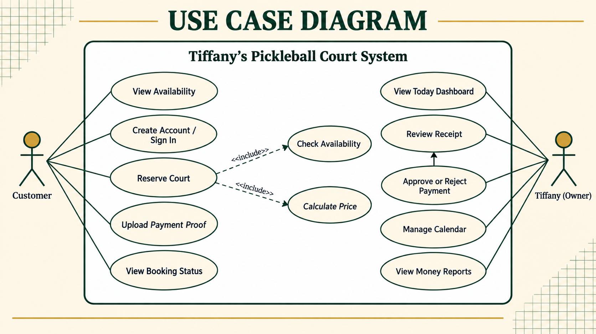
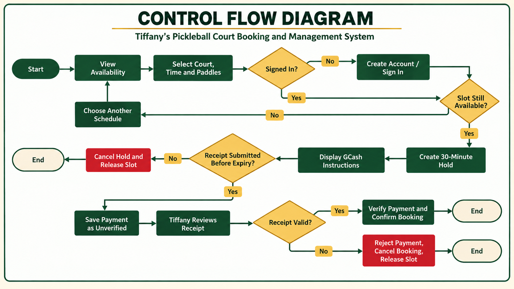
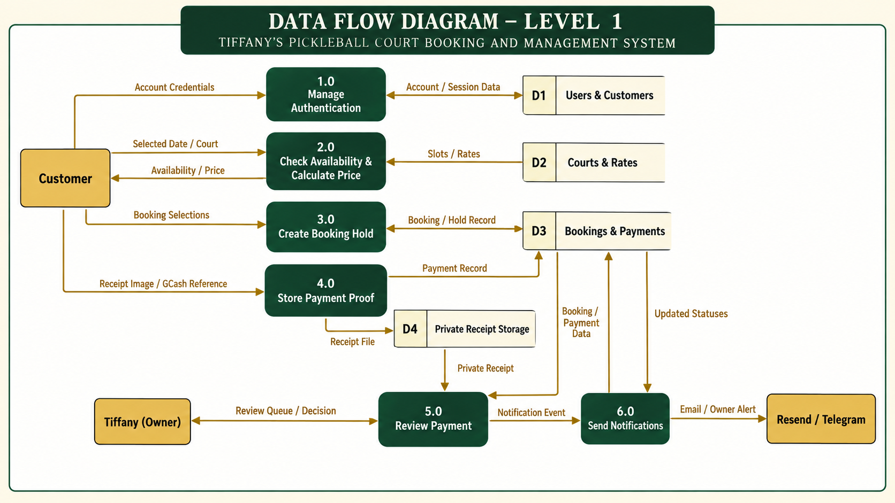
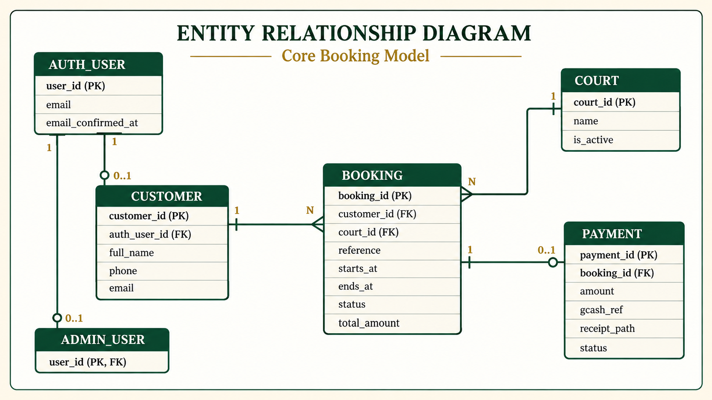
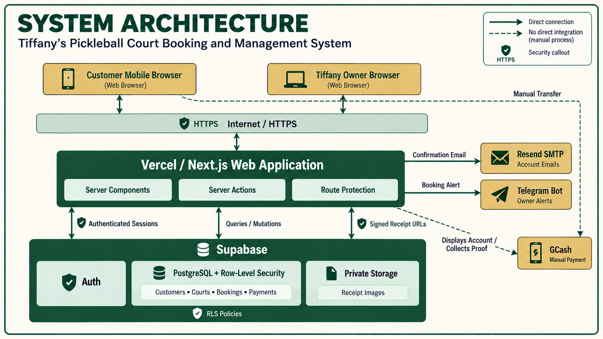

# Tiffany's Pickleball System Models — Study Guide

These diagrams describe Tiffany's real court-booking system. They are not school-system examples.

## Recommended study order

1. **Use Case Diagram** — who uses the system and what they can do.
2. **Control Flow Diagram** — the order of actions and decisions during booking.
3. **Data Flow Diagram** — what information moves between users, processes, and storage.
4. **Entity Relationship Diagram** — how the information is organized in the database.
5. **System Architecture** — how the browser, application, database, storage, email, Telegram, and GCash work together.

## 1. Use Case Diagram

### What it answers

**Who uses the system, and what can each person do?**

- The **Customer** views availability, creates an account, signs in, reserves a court, uploads payment proof, and views the booking status.
- **Tiffany (Owner)** checks the dashboard, reviews receipts, approves or rejects payments, manages the calendar, and views reports.
- Reserving a court includes checking availability and calculating the price.

### One-sentence explanation

> The use case diagram shows the functions available to the customer and the owner.

## 2. Control Flow Diagram

### What it answers

**What happens from the beginning to the end of a booking?**

1. The customer views availability and selects a court, time, and paddles.
2. The system checks whether the customer is signed in.
3. It checks whether the selected slot is still available.
4. It creates a temporary 30-minute hold.
5. The customer pays through GCash and submits the receipt before the hold expires.
6. Tiffany reviews the receipt.
7. A valid payment confirms the booking; an invalid or expired payment releases the slot.

### One-sentence explanation

> The control flow diagram shows the actions, decisions, and possible paths in the booking process.

## 3. Data Flow Diagram — Level 1

### What it answers

**What data enters the system, where is it processed, and where is it stored or sent?**

- Account credentials go to authentication and user storage.
- The selected date and court are checked against court schedules and rates.
- Booking selections create a booking hold.
- The receipt image goes to private storage, while payment details go to the database.
- Tiffany receives the review information and submits an approval or rejection.
- Notification events are sent through Resend or Telegram.

### One-sentence explanation

> The data flow diagram shows how booking and payment information moves through the system.

## 4. Entity Relationship Diagram

### What it answers

**What information is stored in the database, and how are the records related?**

- `AUTH_USER` stores authentication identity information.
- `CUSTOMER` stores the customer's name, phone number, and email.
- `ADMIN_USER` identifies an account that has owner access.
- `COURT` stores the available courts.
- `BOOKING` connects one customer with one court and a scheduled time.
- `PAYMENT` contains the payment amount, GCash reference, receipt path, and review status.

### Important relationships

- One customer can have many bookings.
- One court can appear in many bookings at different times.
- One booking can have zero or one payment record.
- An authentication user can have a customer profile or an administrator role.

### Key terms

- **PK (Primary Key):** uniquely identifies one record.
- **FK (Foreign Key):** connects a record to another table.
- **1 to many:** one record can be related to several records.
- **0..1:** the related record is optional, but there can be no more than one.

### One-sentence explanation

> The ERD shows the database tables, their important fields, and their relationships.

## 5. System Architecture

### What it answers

**What technologies run the system, and how do they communicate?**

- Customers and Tiffany use web browsers through HTTPS.
- The Next.js application runs on Vercel.
- Supabase provides authentication, PostgreSQL, row-level security, and private receipt storage.
- Resend SMTP sends account confirmation emails.
- Telegram sends owner booking alerts.
- GCash is a manual payment method; the application displays payment instructions and collects proof, but it does not directly process the transfer.

### Security points

- HTTPS protects traffic between the browser and the application.
- Authenticated sessions identify signed-in users.
- Row-Level Security controls which database records a user can access.
- Signed URLs provide temporary access to private receipt images.

### One-sentence explanation

> The architecture diagram shows the technologies and services that work together to operate the system.

## Do not confuse these diagrams

| Diagram | Main question |
| --- | --- |
| Use Case | Who can do what? |
| Control Flow | What happens next? |
| Data Flow | Where does the information go? |
| ERD | How is the information stored? |
| Architecture | What technologies run everything? |

## Quick self-test

Try answering these without looking at the notes:

1. What are the two actors in the use case diagram?
2. Why does the system create a 30-minute hold?
3. What happens when the receipt is not submitted before the hold expires?
4. Where is the receipt image stored?
5. What is the relationship between a customer and bookings?
6. Who approves or rejects a payment?
7. Why is GCash shown as a manual external service?
8. What prevents customers from reading another customer's private records?

## Suggested presentation script

> Tiffany's Pickleball Court Booking and Management System has two main users: the customer and the owner. The customer checks availability, reserves a court, pays manually through GCash, and uploads proof of payment. The system temporarily holds the selected schedule to prevent double booking. Tiffany reviews the receipt and either confirms or rejects the payment. The application uses Next.js on Vercel and Supabase for authentication, database records, row-level security, and private receipt storage. Resend handles confirmation emails, while Telegram provides owner alerts.
